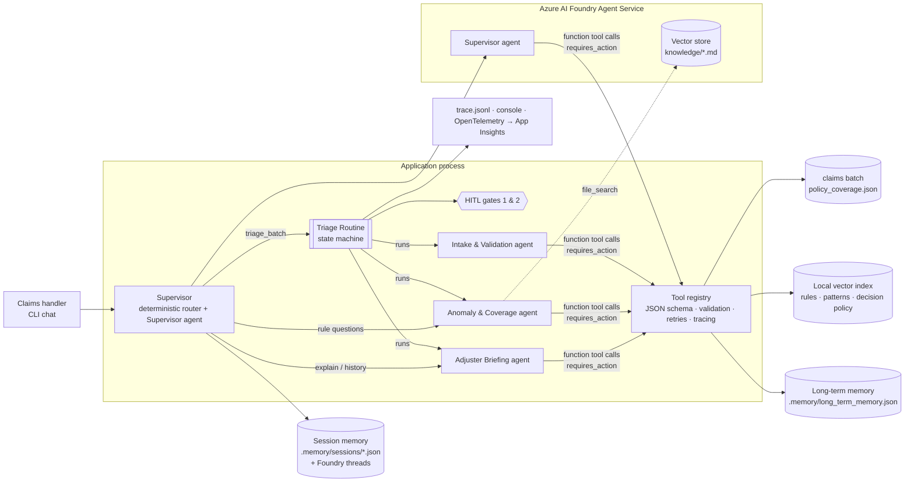
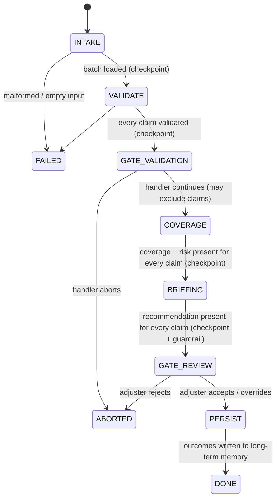
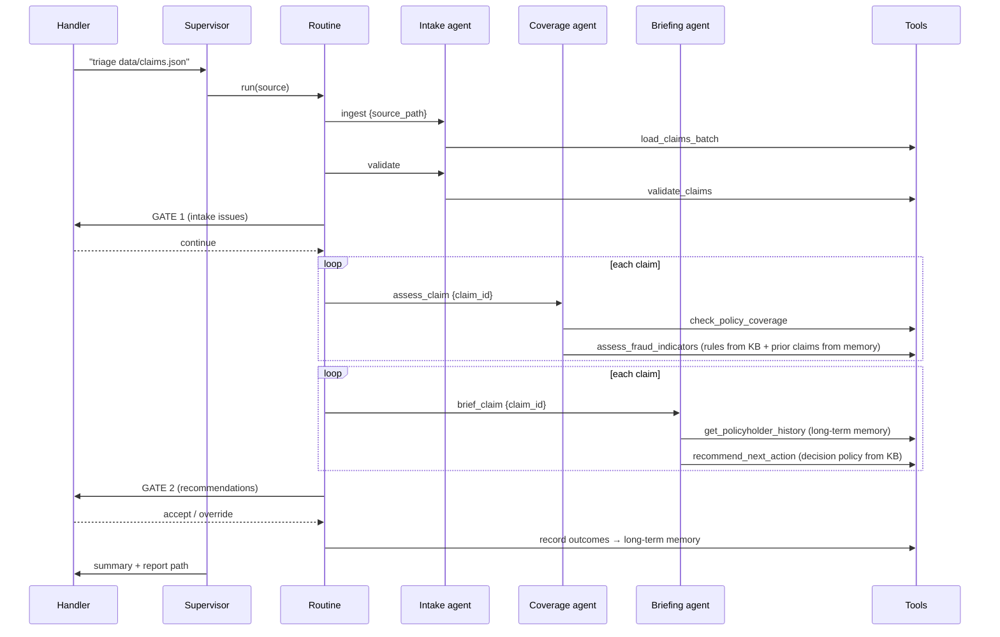

# Architecture

## 1. Component view

Key idea: **agents reason, tools compute, the routine decides the order and owns the gates.**

* Agents (LLM) choose and call tools, and write the prose.
* Tools are deterministic Python functions with strict JSON schemas - validation, coverage
  arithmetic, rule evaluation, memory reads. Facts never come from the model's priors.
* The routine (plain Python) sequences steps, checks post-conditions after each step,
  enforces guardrails, runs the human gates and is the only writer of triage outcomes to
  long-term memory.

## 2. Routine (state machine)

`TRANSITIONS` in `orchestration/routine.py` is the single source of truth; `_transition()`
raises on anything not in the table, and every transition is logged and written to
`runs/<run_id>/trace.jsonl`.

## 3. One claim through the system (sequence)

## 4. Requirement → implementation map

| Requirement | Where |
|---|---|
| Foundry project + Agent Service, SDK | `backends/foundry_backend.py` (`azure-ai-agents` `AgentsClient`: `create_agent`/`update_agent`, `threads`, `messages`, `runs`, `submit_tool_outputs`, `files.upload_and_poll`, `vector_stores.create_and_poll`) |
| ≥4 agents created programmatically | `agents/definitions.py` + `FoundryBackend.setup()`; idempotent via definition hash |
| ≥3 custom function tools with JSON schemas | 10 tools in `tools/*.py`, each a `ToolSpec` with an explicit schema, registered as `FunctionToolDefinition` to its owning agent(s) |
| Short-term memory | `memory/session.py` (turns, focus claim/policy, results) + one Foundry thread per agent per session; `chat --session` resumes |
| Long-term memory across runs | `memory/long_term.py` JSON store (atomic writes, corrupt-file recovery), seeded history; read by `assess_fraud_indicators` and `get_policyholder_history`, written after Gate 2 |
| Knowledge grounding | `knowledge/*.md` → `LocalVectorStore` (TF-IDF, cached) + Foundry vector store / `file_search`; rules parsed from the KB and evaluated by a safe parser (`knowledge/rules.py`) |
| Explicit, traceable routine with HITL | `orchestration/routine.py` (`State`, `TRANSITIONS`, checkpoints, guardrail), `orchestration/hitl.py` |
| Supervisor routing + multi-turn | `orchestration/supervisor.py` (deterministic router with pronoun resolution → supervisor agent fallback) |
| Error handling | invalid tool args, transient tool failures (retry + backoff), persistent tool failure (`tool_failure` finding), agent failure/timeout (retry → degraded fallback, run cancel in Foundry), Foundry 429/5xx retry, malformed input (FAILED), corrupt memory |
| Observability | `observability.py`: tagged console logs, `trace.jsonl`, OpenTelemetry spans, optional Azure Monitor export + `AIAgentsInstrumentor` |

## 5. Design decisions worth defending

1. **Deterministic tools, LLM for language.** Coverage arithmetic and date logic are never
   left to a model. The briefing agent must use `recommend_next_action`'s result; the routine
   overrides it if the text disagrees (guardrail, logged).
2. **Rules as data.** Thresholds live in `underwriting_rules.md`; change `<= 7` to `<= 3`
   and the system changes (see `test_rules_come_from_knowledge_not_code`). The same files are
   indexed for retrieval, so explanations quote the exact rule that fired.
3. **Per-claim isolation.** Coverage and briefing run per claim, so one timeout or bad record
   degrades one claim, not the batch.
4. **Humans own irreversible steps.** Nothing reaches long-term memory before Gate 2;
   `auto_approve` is a recommendation that a human confirms.
5. **Hybrid routing.** Regex routing for known intents is free, fast and testable; the
   Supervisor agent handles the long tail with read-only tools.
6. **Manual tool loop** instead of `enable_auto_function_calls`, so every call is validated,
   retried, logged and traced by our registry.
